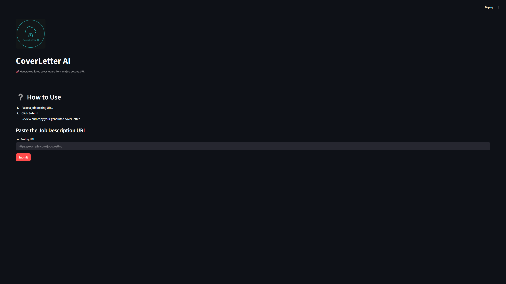

<!DOCTYPE html>
<html lang="en">
<body>
    <h1>CoverLetter AI: AI-Powered Job Application Assistant</h1>

<h2>Market Problem & Solution</h2>

Research shows the average professional spends 11+ hours per week on job applications during an active search, with 40% of that time dedicated to customizing application materials. Our market analysis identified these critical pain points:

<ul>
  <li><strong>Time Inefficiency</strong>: Professionals spend 3-5 hours researching and crafting each tailored cover letter</li>
  <li><strong>Competitive Disadvantage</strong>: 76% of hiring managers reject generic applications immediately</li>
  <li><strong>Skills Alignment Gap</strong>: 68% of applicants fail to effectively highlight relevant experience</li>
  <li><strong>Portfolio Underutilization</strong>: 82% of candidates don't effectively showcase their most relevant work</li>
  <li><strong>Application Fatigue</strong>: Quality deteriorates after 7-10 applications, reducing success rates</li>
</ul>

CoverLetter AI is a sophisticated application that leverages artificial intelligence to streamline the job application process. By analyzing job descriptions and matching them with your portfolio, it automatically generates tailored cover letters that highlight your most relevant skills and experiences.

 

 

<h2>Project Overview</h2>

This tool uses advanced natural language processing to extract key information from job postings, including required skills, experience levels, and responsibilities. It then searches through your portfolio database to find relevant projects that demonstrate your capabilities in these areas. Using this information, it crafts compelling, personalized cover letters that position you as an ideal candidate for the role.

The application features a clean, intuitive Streamlit interface that makes it accessible to users regardless of their technical background.

<h2>Key Features</h2>

<ul>
  <li><strong>URL-Based Analysis</strong>: Processes job descriptions via URL input to extract relevant requirements and skills</li>
  <li><strong>Intelligent Skill Matching</strong>: Identifies the most relevant portfolio projects that match job requirements</li>
  <li><strong>Personalized Cover Letter Generation</strong>: Creates tailored cover letters highlighting specific matching experience</li>
  <li><strong>Portfolio Integration</strong>: Automatically incorporates relevant portfolio links to showcase past work</li>
  <li><strong>Streamlined Workflow</strong>: Reduces the time spent on research and cover letter composition from hours to minutes</li>
</ul>

<h2>Technical Implementation</h2>

The system is built using a modern tech stack:

<ul>
    <li><strong>Groq & Llama 3.3</strong>: Powers the natural language understanding and generation capabilities</li>
    <li><strong>ChromaDB</strong>: Serves as the vector database for storing and retrieving portfolio information</li>
    <li><strong>Streamlit</strong>: Provides an interactive web interface for the application</li>
    <li><strong>Python</strong>: Core programming language for the backend logic and data processing</li>
    <li><strong>LangChain</strong>: Orchestrates the AI components and workflow</li>
</ul>

This modular architecture ensures the system is both powerful and scalable, capable of handling various job descriptions while maintaining personalization quality.

<h2>Project Structure</h2>

<ul>
  <li><code>main.py</code>: The Streamlit application entry point</li>
  <li><code>pipeline.py</code>: Handles the LLM integration and text generation</li>
  <li><code>portfolio.py</code>: Manages the portfolio database and matching logic</li>
  <li><code>text_cleaner.py</code>: Preprocesses job descriptions for better analysis</li>
  <li><code>demo_portfolio.csv</code>: Sample portfolio data for demonstration</li>
</ul>

<h2>Usage Impact</h2>

    
This tool addresses a critical pain point for job seekers who currently must:

    
<ul>
    <li>Search through numerous job postings</li>
    <li>Analyze job requirements and qualifications</li>
    <li>Identify relevant skills and experiences from their background</li>
    <li>Craft unique cover letters for each application</li>
    <li>Find ways to stand out among other applicants</li>
</ul>
    

By automating these steps, CoverLetter AI dramatically reduces the time and effort required for job applications while maintaining or improving the quality of personalization that makes cover letters effective.

<h2>Getting Started</h2>

<ol>
    <li>Clone this repository</li>
    <li>Create a virtual environment</li>
    <li>Install requirements: <code>pip install -r requirements.txt</code></li>
    <li>Create a <code>.env.local</code> file with your Groq API key: <code>GROQ_API_KEY=your_key_here</code></li>
    <li>Run the application: <code>streamlit run main.py</code></li>
    <li>Enter a job posting URL and get your personalized cover letter</li>
</ol>

<h2>Future Enhancements</h2>

<ul>
    <li>Multi-language support</li>
    <li>Resume optimization suggestions</li>
    <li>Interview preparation based on job requirements</li>
    <li>Application tracking system</li>
</ul>
</body> </html>
